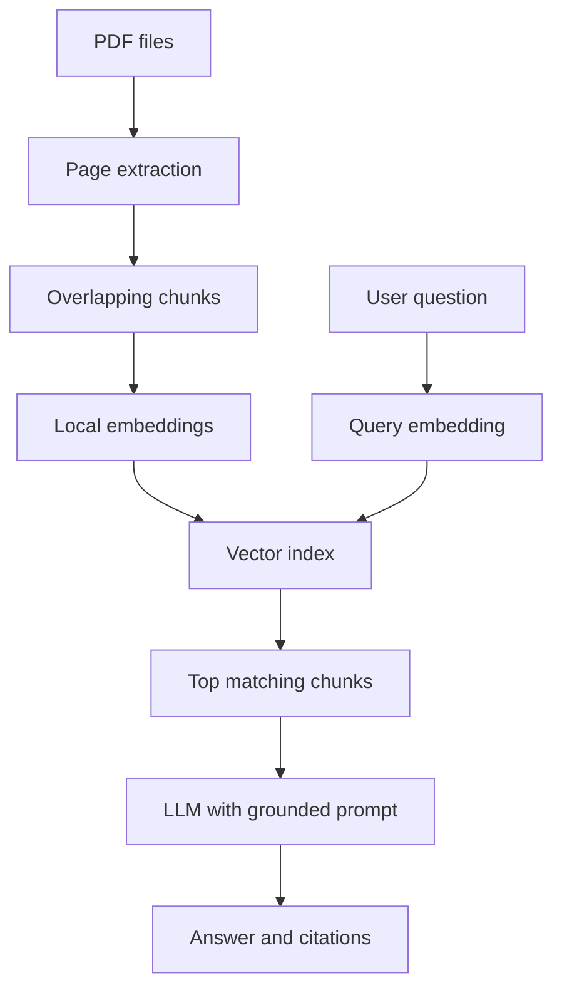

# DocumentMind — AI Document Assistant

DocumentMind is a small, understandable Retrieval Augmented Generation (RAG) application. It extracts text from PDFs, creates local multilingual embeddings, retrieves semantically relevant passages and asks a language model to answer with page-level citations.

The project deliberately implements the core pipeline without LangChain. This keeps the architecture visible and makes it easier to explain in a technical interview.

## Features

- Upload and search one or multiple PDFs
- Local multilingual embeddings with Sentence Transformers
- In-memory cosine similarity search
- Adjustable chunk size, overlap and retrieval depth
- Page-level source metadata and similarity scores
- Local answer generation with Ollama
- Optional OpenAI API provider
- Retrieval-only mode that works without an LLM
- Basic protection against prompt instructions embedded in documents
- Automated tests for chunking, retrieval and the full pipeline

## Architecture



## Quick start

Python 3.11 is recommended.

```bash
python3 -m venv .venv
source .venv/bin/activate
pip install -r requirements.txt
streamlit run app.py
```

On first use, the embedding model is downloaded once. PDF text and embeddings stay local.

### Free local answers with Ollama

Install [Ollama](https://ollama.com), then run:

```bash
ollama pull llama3.2:3b
ollama serve
```

Select **Ollama (local & free)** in the application. On a Mac, the Ollama app may already run the service, so `ollama serve` is not always necessary.

You can test retrieval immediately without Ollama by selecting **Retrieval only (no LLM)**. A three-page example is available in `sample_documents/ai_at_work.pdf`.

## Run tests

```bash
python -m unittest discover -s tests -v
```

## Project structure

| Path | Responsibility |
| --- | --- |
| `app.py` | Streamlit UI and session state |
| `rag/pdf.py` | Page-by-page PDF extraction |
| `rag/chunking.py` | Overlapping text chunks |
| `rag/embeddings.py` | Local embedding model |
| `rag/vector_store.py` | Cosine similarity index |
| `rag/generation.py` | Ollama, OpenAI and retrieval-only answers |
| `rag/pipeline.py` | End-to-end orchestration |
| `tests/` | Unit and pipeline tests |

## Known limitations

- Scanned PDFs require OCR and are not supported yet.
- The vector index is held in memory and is rebuilt after a restart.
- Page-level citations identify the source passage, but automatic citation-faithfulness scoring is not included yet.
- Retrieval quality depends on the embedding model, chunking configuration and documents.
- Uploaded PDFs should be treated as untrusted input; this MVP is for local demonstration, not public production use.

## Possible next improvements

1. Add OCR for scanned PDFs.
2. Persist the index with Chroma or PostgreSQL/pgvector.
3. Create an evaluation dataset and calculate Recall@K.
4. Add authentication and per-user document collections.
5. Dockerize and deploy the application.

## Portfolio description

> Developed an AI-powered PDF assistant using Python and RAG. Implemented page-aware text extraction, configurable chunking, multilingual embeddings, cosine-similarity retrieval and grounded LLM answers with source citations. Added a Streamlit interface, local Ollama support and automated pipeline tests.

## Privacy note

Embeddings are computed locally. When Ollama is selected, answer generation is also local. When OpenAI is selected, only the retrieved passages and question are sent to the configured API.

